<!--
Profile README for KamranBoroomand
Style: security console / terminal (dark + yellow)
-->

<h1>Kamran Boroomand</h1>

  Security-minded builder of Linux-first projects, web UIs, and privacy tooling. 
  Focus: operator-grade UX, clean repo hygiene, and deployable systems.

  <a href="https://kamranboroomand.ir/">Portfolio</a> •
  <a href="https://nullid.kamranboroomand.ir/">NullID</a> •
  <a href="https://packman.kamranboroomand.ir/">PacMan</a>

<pre>
STATUS: shipping Linux-first projects and deployable web demos
THEMES: privacy • security tooling • operator-grade UX
STACK: Python • FastAPI • React/Vite • TypeScript
OPS: Linux • Raspberry Pi • CI/CD • static hosting
</pre>

## Featured Projects

### NullID
Security-console style web experience for privacy and security utilities.  
Repo: https://github.com/KamranBoroomand/NullID  
Live: https://nullid.kamranboroomand.ir/

### PacMan
A branded, shareable static web game deployment.  
Repo: https://github.com/KamranBoroomand/PacMan  
Live: https://packman.kamranboroomand.ir/

### Portfolio
Personal portfolio and public work showcase.  
Repo: https://github.com/KamranBoroomand/Portfolio  
Live: https://kamranboroomand.ir/

## Linux Focus

- Builds and deploys on Linux (including Raspberry Pi environments)
- Preference for reproducible setups, logs-first debugging, and clean automation
- Practical security mindset: strict defaults, minimal attack surface, no fluff

  
<b>Optional: GitHub signals</b>

  

    
     
    
  

